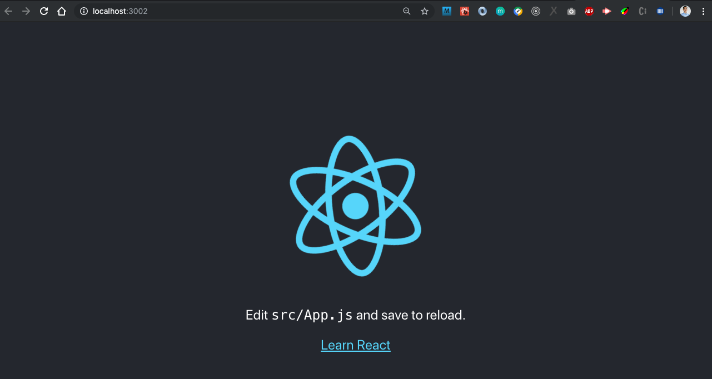

# REACT JS

## Pengenalan React

React adalah open source yang sangat membantu untuk membangun UI lebih mudah dan cepat. Jalur pembelajaran ini akan mencakup berbagai API dan tool harus dipertimbangkan untuk meningkatkan kinerja dan kegunaan aplikasi.

Panduan ini akan menunjukkan cara untuk bangkit dan berjalan denan aplikasi React. Setiap panduan lain pada buku iniakan membahas topik untuk mengoptimalkan kecepatan atau aksesibilitas aplikasi React.

### Kenapa ini membantu banget?

Ada banyak konten yang menjelaskan cara membuat aplikasi yang cepat dan andal, tetapi tidak banyak yang menunjukkan cara membuat aplikasi React yang cepat dan andal . Panduan ini mencakup semua dari perspektif aplikasi React di mana hanya library, API, dan fitur khusus untuk ekosistem React yang disebutkan.

### Apa yang akan kamu pelajari?

Tutorial pada pembelajaran ini *tidak hanya fokus* pada:

- Cara menggunakan React
- Bagaimana React bekerja

Meskipun kedua konsep ini akan disentuh saat dibutuhkan, semua panduan dan `kode` di bagian ini akan berfokus pada bagaimana membangun web React yang cepat dan dapat diakses. Untuk alasan ini, diperlukan **pengetahuan dasar React**.

### Membuat Aplikasi React

Create React App ([CRA](https://facebook.github.io/create-react-app/)) adalah cara termudah untuk memulai membangun aplikasi React. Ini memberikan pengaturan default dengan sejumlah fitur inti yang digunakan, termasuk sistem `build` yang berisi `bundler modul` (webpack) dan transpiler (Babel).

Pada `shell` atau terminal, Anda hanya perlu menjalankan perintah berikut untuk membuat aplikasi baru:

```bash
create-react-app nama-aplikasi
```

> Pastikan terlebih dahulu untuk sudah menginstalkan CRA pada komputer anda dengan `sudo yarn global add create-react-app`

Setelah perintah diatas selesai dieksekusi, Anda dapat menjalankan aplikasi dengan perintah berikut:

```bash
cd nama-aplikasi
yarn start
```

Berikut memperlihatkan halaman aplikasi React yang baru saja di-buat.



Berikut memperlihatkan struktur direktori dan halaman web aktual dari aplikasi CRA yang baru saja di-buat.

```bash
.
├── README.md
├── package.json
├── public
│   ├── favicon.ico
│   ├── index.html
│   └── manifest.json
├── src
│   ├── App.css
│   ├── App.js
│   ├── App.test.js
│   ├── index.css
│   ├── index.js
│   ├── logo.svg
│   └── serviceWorker.js
└── yarn.lock
```

> Meskipun CRA membuatnya mudah untuk mulai membangun aplikasi React, ada banyak cara berbeda untuk mulai membangun situs dengan React. Bisa menggunakan CDN atau lainnya.

Struktur direktori aplikasi CRA baru hanya berisi file yang benar-benar perlu Anda modifikasi untuk bekerja pada aplikasi Anda. [Dokumentasi CRA](https://facebook.github.io/create-react-app/docs/folder-structure) menjelaskan ini secara rinci.

## React Dasar

Pada React sendiri memiliki beberapa hal dasar yang harus dipahami:
1. Component
2. Props
3. State
4. Lifecycle

### Component
Component dalam react dapat dibuat dengan 2 cara, yatu dengan membuat class atau dengan membuat function. Tapi apa bedanya class dengan function pasti memiliki kelebihan masing-masing.

1. Dengan class

```javascript
import React, { Component } from 'react'

class App extends Component {
  constructor(props) {
    super(props)
    this.state = {
      name: '',
    }
  }
  
  render() {
    return (
      <div>Wellcome Asrul</div>
    )
  }
}

export default App
```

2. Dengan function

```javascript
import React from 'react'

const Hello = ({ name }) => (<div>Hello, {name}!</div>);

export default Hello
```

Lantas bagai mana cara mengaksesnya?
Okay, cara mengakses komponen adalah dengan menjadikannya sebagai tag HTML, contoh component Hello akan diakses menjadi `<Hello />`

> Perdu diingat bahwa component harus diawali dengan huruf kapital sehingga sistem dapat membedakan code HTML dan kode Component

### Props
Props adalah cara komponent mengoper data ang berasal dari parent ke child dengan kata lain garis lurus kebawah.

```javascript
<Hello name="Asrul">
```
Dari component diatas misal sebuah komponent yang berisi komponent `Hello`, maka itu akan menurunkan data pada component `Hello` dengan props dengan `key` **name** dan `value` **Asrul**

### State
```javascript
state = {
  name: ''
}
```
```javascript
this.setSetate({
  name: 'Asrul'
}, callback)
```

### Lifecycle
React sendiri memiliki siklus hidup kompenen, maksudnya saat kapan aksi itu akan dijalankan.
- componentDidMount()
- componentWillMount()
- componentDidUpdate(prevProps, prevState)

